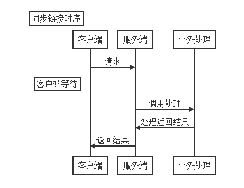
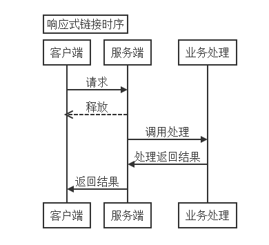
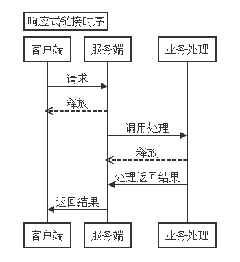

## Webflux什么时候用和怎么用
webflux是基于reactive的异步网络服务框架。
#### 一、阻塞式的链接方式
传统的网络链接方式是同步的方式，也就是阻塞的方式。

如上面的时序图，客户端发出请求后就被阻塞了，要等待后续处理将结果返回。
这种方式要想提高并行度就需要使用更多的链接，比如Tomcat默认的方式就是建立连接池，保留大量的链接，以应对大量的客户。
#### 二、响应式链接方式
异步的时序图是这样：

响应式（事件驱动）中，客户端发送了请求后，服务端立即释放了这个链接。之后再去做业务处理，有结果后再返回给客户端，客户端接收结果。

响应式要求客户端和服务器端都要做相应的改变。客户端要能够在释放链接资源后还能接收到结果，服务端要能在接收请求后释放资源，并将结果正确返回给客户端。

spring webflux是通过Reactor Core来实现的。[Reactor的文档](https://projectreactor.io/docs)

响应式应对大量客户请求并不需要保持大量的了链接，因为链接在传输完请求后就被释放了，并不会阻塞在那里等待结果。所以响应式一般只需要cpu核数的链接，再多的链接并不能真的提高并行能力。

#### 三、什么时候用Webflux
从上面的时序图中可以了解到，异步方式优点在于可以及时释放资源，并不会实质性的对整体的处理速度有大的改善，处理速度仍然受限于业务处理的能力。

所以官网上何时使用Webflux的第一条原则就是：**如果您现有的同步方式的应用没出现任何问题，就不需要修改它。**

**如果您的应用使用大量连接池也很难满足客户请求，那么可以考虑改用响应式的程序。**

还要考虑一个因素，spring现在是有两套web框架，一套是spring mvc的阻塞式，一套是webflux的响应式。长远看，spring不可能同时维护升级两套框架。spring在发布5.0版本前，曾考虑是否将spring mvc变为不推荐(deprecated)。所以即使现在你不需要webflux，也应该开始学起来了。

如果使用webflux还需要注意以下几点：
1. 您的应用应该尽量从头到尾都采用响应式编程。如果只是某一部分采用响应式而其它处理还是阻塞式，响应式带来的好处将大打折扣。全面响应式的时序图如下：

   
   
   这需要您采用的技术栈都是支持响应式编程的。这可能会导致过渡过程中的学习曲线变得陡峭，尤其是开发团队比较大时。
2. 服务器使用默认的Netty是合理的选择。
3. 使用java 8的lambda可以很好的应用响应式编程。

#### 四、怎么写Webflux程序
这里只做几个非常简单的入门例子供大家参考。
1. 服务端简单的例子

   代码参考：toplchx.example.webflux.server.ReactiveController

   Webflux的注解关键字和MVC的是一样的，区别只是返回类型不同。响应式的方法可以返回两种类型Mono和Flux。Mono返回单个信息，Flux返回一串信息。本例返回一个Mono对象。方法里sleep了3秒，模拟业务逻辑执行时间。正常情况下，业务逻辑也应该采用响应式调用。最后返回信息。
   
2. 阻塞方式发送请求

   代码参考：toplchx.example.webflux.client.BlockClient
   
   先看一下阻塞方式的调用。用httpclient创建链接，发送3次请求。因为是单线程，所以要在一个请求返回之后才能发送下一次。一次执行需要3秒，3次就是9秒。可以从运行之后客户端和服务端的日志中验证这一点。这种方式如果想提高总执行时间，就需要3个线程并发请求。
   
3. 响应式发送请求

   代码参考：toplchx.example.webflux.client.ReactiveClient1
   
   使用WebClient来发送响应式请求。使用CountDownLatch是为了让main方法在收到3次返回结果后再结束。如果没有这个机制，main方法会在发送3次请求后就结束，不会等待返回结果。
   
   响应式的方式会近似同时发送3次请求，并在3秒后接收到3个返回结果。其执行方式类似于阻塞的线程池方式。想象下，如果客户端发送1万个请求，阻塞式需要1万个线程的线程池，而响应式只需要cpu核数个线程，虽然这两种结果并不完全一样，但使用的资源明显是响应式的更低。
   
   关于响应式的编程方法可以参考[Webflux的官方文件](https://docs.spring.io/spring/docs/current/spring-framework-reference/web-reactive.html#spring-webflux)和[Reacitor的文档](https://projectreactor.io/docs)。
   
4. 更响应式的客户端写法

   代码参考：toplchx.example.webflux.client.ReactiveClient2
   
   使用Flux.range来生成3个事件，flatMap里定义3个时间执行什么操作，这里面系统会自动判断是否需要启用新的线程来完成操作。blockLast是阻塞到最后一个结果返回。两个doOnNext是在之前定义的事件发生时执行的处理。
   
5. 更响应式的服务端写法

   服务器端响应式的原则就是尽量所有处理都是响应式的。比如数据库的操作，JDBC是阻塞式的，所以在响应式服务端不应该使用JDBC。Spring Data提供响应式的数据库操作方式，参考[介绍文档](https://spring.io/blog/2016/11/28/going-reactive-with-spring-data)
   
#### 五、典型应用场景分析
   
想象一个应用，需要收集巨量的数据，并对这些数据做处理和分析。

这个场景的接收服务需要收集非常多的数据，频次会非常密集，同时它不需要复杂的互动（最多返回接收数据成功），这非常适合使用响应式来实现这个接口。合适的做法是接口中不做任何业务逻辑，直接将数据发送给消息队列（比如KAFKA，有项目可以提供[KAFKA的响应式生产者](https://projectreactor.io/docs/kafka/release/reference/)），同时返回接收成功标识。在消息队列的消费者收到数据后再做相应的处理。

如果客户发送数据端也在开发范围内，也可以通过设置服务端背压来控制传输速度适应处理速度，但要考虑客户端的缓存问题。

#### 六、参考资料
1. [非常全的响应式编程的例子](https://github.com/hantsy/spring-reactive-sample)
2. [客户端、服务端的例子](https://github.com/joshlong/flux-flix-service)
3. [spring webflux开发者写的例子](https://github.com/rstoyanchev/reactive-for-webmvc)
4. [讲的非常好的视频](https://www.youtube.com/watch?v=IZ2SoXUiS7M&list=PLAdzTan_eSPQsR_aqYBQxpYTEQZnjhTN6&index=50)